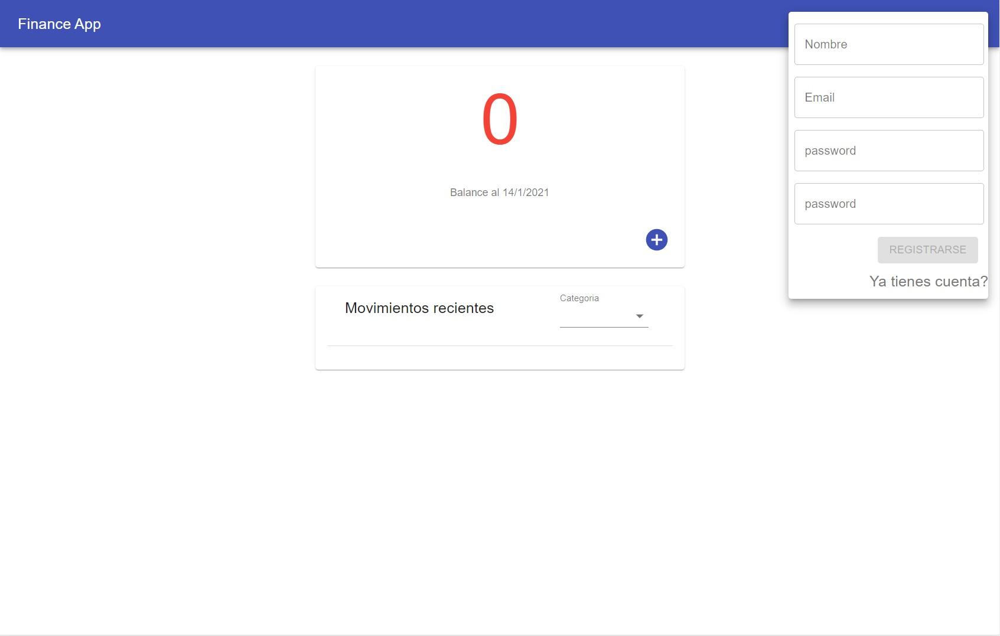
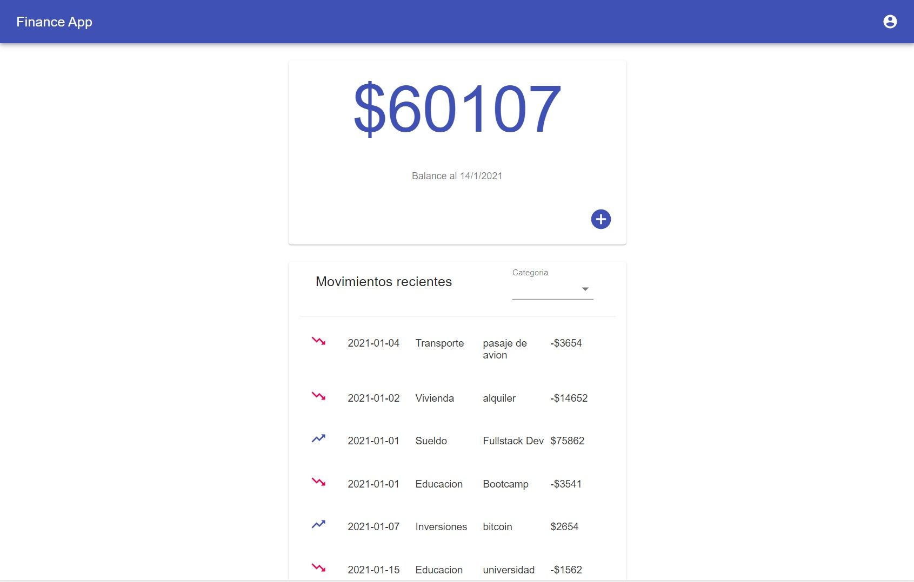
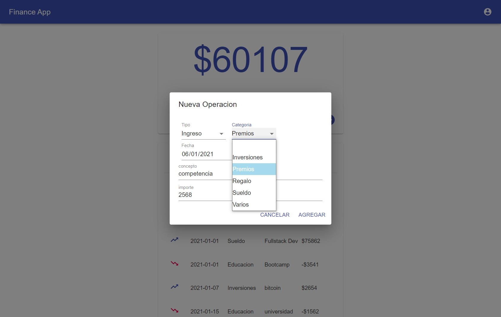

# finance-app

# How to start the project:

If you want to see the page for yourself, you'll need to do the following:

- Clone the repository
- Install [PostgreSQL](https://www.postgresql.org/) on your computer and create a database called `financeapp`.
- Create a `.env` file in in the `api` folder with the following contents:

```
DB_USER={Your postgreSQL user}
DB_PASSWORD={Your postgreSQL password}
DB_HOST=localhost

```

The app doesn't have any users created by default, you'll have to register to use the app

# Previews

### Home page:



### Shopping Cart:



### Checkout:


